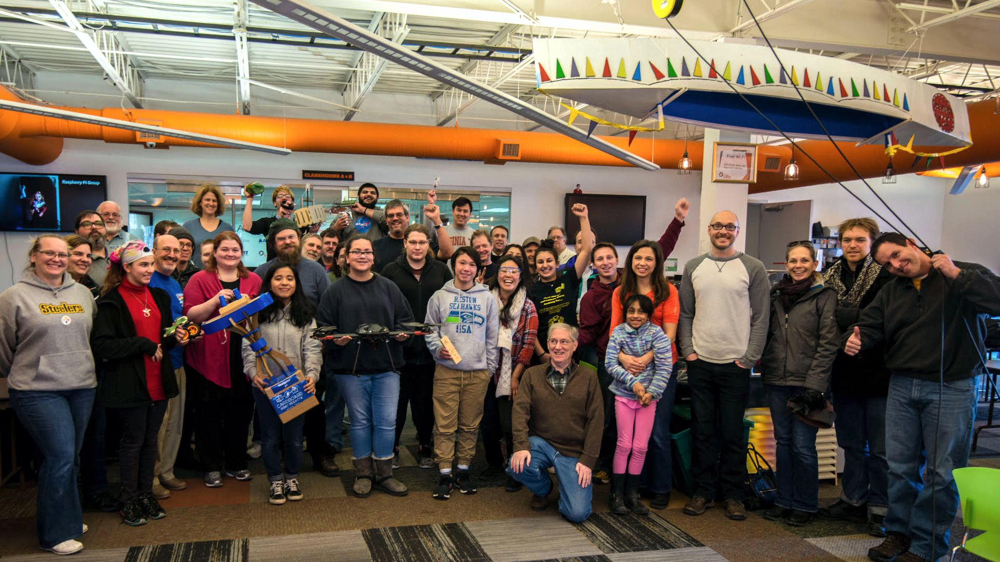
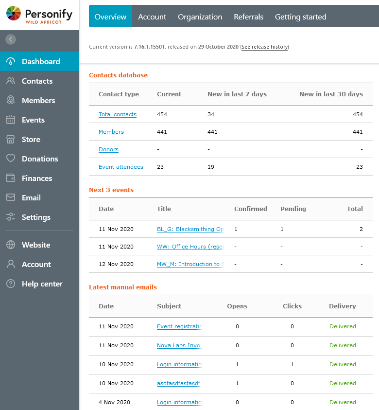

==========
Background
==========

Nova Labs announced events and registered participants on Meetup.com until
Meetup lost the ability to collect registration fees on November 10, 2020.
To replace Meetup, Nova Labs selected Wild Apricot to process registrations and
collect fees.
Meetup2apricot copies events from Meetup to Wild Apricot.

The Players
-----------

.. index:: Nova Labs

|Nova Labs|_ is a makerspace in Reston, Virginia with over 350 members (as of
September 2020).
Nova Labs members can access a woodshop, a metal shop, laser cutters, 3D
printers, an electronics bench, sewing and embroidery machines, vinyl cutters,
a blacksmithing forge, and many other maker tools.
To build communities of makers, Nova Labs offers a busy schedule of classes,
meetings, workshops, and other events to its members and guests.
:numref:`Figure %s <nova_labs_group_photo>` shows a few dozen Nova Labs members.

.. |Nova Labs| replace:: **Nova Labs**

   Nova Labs community members (c. 2018).

.. index::  Meetup.com

|Meetup.com|_ is a web-based service that helps organize physical and virtual
events for people with similar interests.
Meetup.com maintains a database of events, provides event web pages, and
handles attendee registration details.
Equally important, Meetup.com suggests other related events to participants,
helping event organizers to reach potential new attendees.

.. |Meetup.com| replace:: **Meetup.com**

Nova Labs maintains its `full calendar of events`_ on Meetup.
:numref:`Figure %s <meetup_calendar_screenshot>` shows the Meetup calendar
for one week of Nova Labs events.

.. figure:: images/screenshots/meetup-calendar.png
   :alt: Screenshot of a Meetup calendar of events at Nova Labs
   :name: meetup_calendar_screenshot
   :align: center

   An example of a Meetup calendar of events at Nova Labs.

.. index:: Wild Apricot

|Wild Apricot|_ is a web-based membership management system targeted toward
non-profit organizations.
Wild Apricot maintains a customizable database of members and other contacts.
Members and contacts may register for events, puchase products, make donations,
and view web pages, all within the Wild Apricot framework.
Wild Apricot provides organization administrators summary and detail
informations about member activity.
(:numref:`Figure %s <wild_apricot_dashboard>`) shows part of the top level Wild
Apricot dashboard for Nova Labs.

.. |Wild Apricot| replace:: **Wild Apricot**

         which shows membership level counts, upcoming events, recent emails,
         etc.
   :name: wild_apricot_dashboard
   :align: center

   The Wild Apricot dashboard summarizes Nova Labs member activity.

Meetup Ends Support for Registration Fees
-----------------------------------------

.. index:: WePay

Payment processor `WePay terminated its services for Meetup`_ on November 10, 2020.
Meetup hopes to have a new event fee system in early 2021.
When Meetup provided a one-month notice to its customers, Nova Labs reviewed
options for paid event registration, selecting Wild Apricot.

Wild Apricot Concept of Operation
---------------------------------

Beginning November 10, 2020, Meetup events will be mirrored on Wild Apricot.
The Nova Labs Events Team will add links from Meetup events to their Wild
Apricot counterparts.
Members and others who discover events via Meetup can click the provided link
to view and register for the same event in Wild Apricot.
The Nova Labs web site links will direct members and visitors directly to
events in Wild Apricot.
Event registration payments will be collected and tracked by Wild Apricot.

The Nova Labs Information Technology Team initiated several projects to support
the rapid transition to Wild Apricot.

* *Spaceman2apricot* to load and synchronize member data with the existing
  *Spaceman* maker space management program.
* *Meetup2apricot* to load events from Meetup to Wild Apricot.
* Wild Apricot web site layout and styling.
* Many other smaller changes.

.. _`meetup.com`: https://www.meetup.com/
.. _`Wild Apricot`: https://www.wildapricot.com/
.. _`Nova Labs`: https://www.nova-labs.org/
.. _`full calendar of events`: https://www.meetup.com/NOVA-Makers/events/calendar/
.. _`WePay terminated its services for Meetup`: https://help.meetup.com/hc/en-us/articles/360050701271-WePay-deactivation-FAQs
